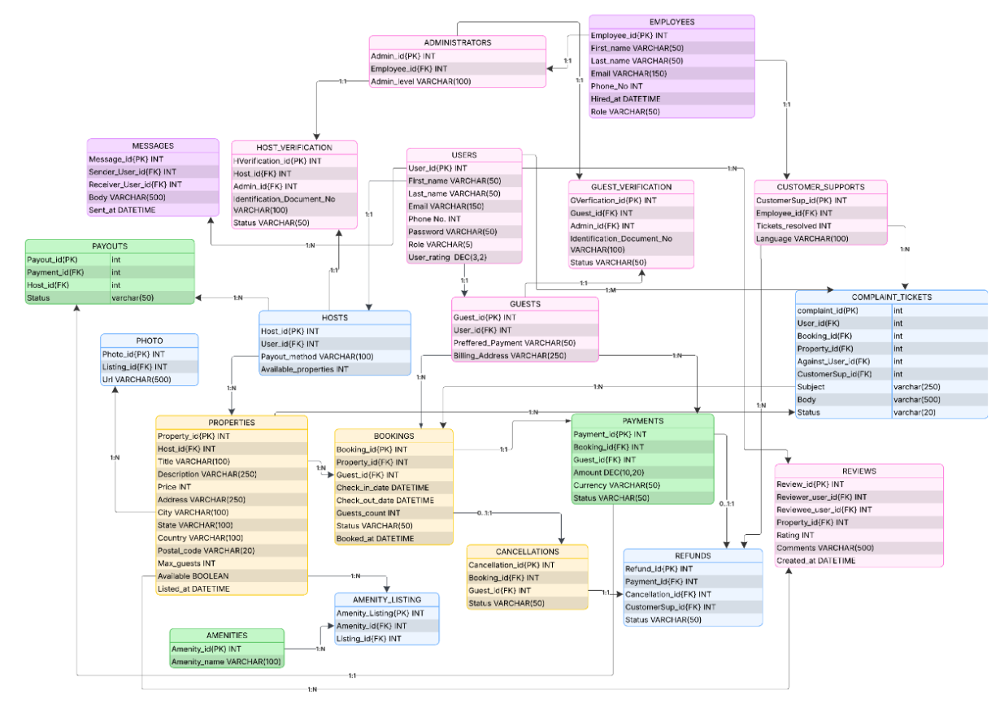

# 🏡 Airbnb Data Mart (MySQL)

A fully normalized, 20-entity relational Data Mart designed to model the operational and transactional workflows of the **Airbnb** platform. 

> 🎓 This project was created as part of the *Build a Data Mart in SQL (DLBDSPBDM01)* course at **IU International University of Applied Sciences**.

---

## **Technical Specification:** 

● **Database Management System:** MySQL Community Server (version 8.0 or higher)  
● **GUI (Graphical User Interface):** MySQL Workbench (Community Edition)  
● **Engine:** InnoDB (default engine for mySQL versions 8.0+)  
● **Database Name:** airbnb_datamart  

---

## 📌 Project Overview

The first step of this project was analyzing the fundamental structure and functionality of an Airbnb system designed to connect guests to hosts renting out properties. This was done by creating an entity relationship diagram to map out the key user groups, the actions they perform and the data and functions required for the system to operate correctly.

Next using the ER diagram as a blueprint the physical database was created on **MySQL (InnoDB engine)**. 

## The system includes
* **Identity Management:** Role-based subtyping for Guests, Hosts, Administrators, and Customer Support.
* **Accommodation:** Complex property listings, photo media stores, and a Many-to-Many resolution for amenities.
* **Reservations & Financial Management:** Booking management coupled with double-entry style financial logs (Guest Payments, Host Payouts, Cancellations, and Refunds).
* **Communication:** User reviews and self-referencing recursive peer-to-peer messaging.

---

## 🏗️ Architecture & Database Design

The database strictly adheres to **Third Normal Form (3NF)** to eliminate redundancy and maintain data integrity:

* **Supertypes** A central `USERS` entity branches into `GUESTS` and `HOSTS` via enforced 1:1 foreign key constraints, eliminating empty (`NULL`) fields. A similar hierarchy branches `EMPLOYEES` into `ADMINISTRATORS` and `CUSTOMER_SUPPORTS`.
* **Many-to-Many (N:M) Relationships:** An associative junction table (`AMENITY_LISTING`) resolves non-exclusive amenities across properties without duplicating records.
* **Audit-Preserving Referential Actions:** Core user-dependent records use `ON DELETE CASCADE`, while administrative logs (`REFUNDS`, `COMPLAINT_TICKETS`) use `ON DELETE SET NULL` to ensure financial audit trails survive personnel turnover.

---

## 📂 Files
Below is an explanation of the files required to deploy the database 

2.1) **01_Schema.sql**   
This file contains the Data Definition Language (DDL) statements, these are the commands used 
to create the database tables. This file creates the database airbnb_datamart and builds all 20 
tables and sets up primary keys, foreign keys and constraints. 

2.2) **02_data.sql**    
This file contains the Data Manipulation Language (DML) statements, these are the commands 
used to insert and populate data entries into the tables. This file inserts 440 rows of dummy data 
into the defined tables. 

2.3) **03_test_cases.sql**   
This file contains the Data Query Language (DQL) statements, these are the commands used to 
test relationships between tables. 

2.4) **04_extract_metadata.sql**   
information_schema.TABLES query used to get total table, total records count as well as disk 
storage volume. 

---

## ⚡ Installation Guide  

● **Step 1: Clone the repository**
 
● **Step 2: Database Connection** 
  1. Launch MySQL Workbench 
  2. Click on the local MySQL connection instance 
  3. If needed enter the database administrative password and then click ok 
    
● **Step 3: Executing DDL schema** 
  1. In MySQL Workbench go to File → Open SQL Script 
  2. Navigate to 02-Development/01_schema.sql and click Open 
  3. Run the entire script by clicking the execute icon 
(In the output panel at the bottom there should be green checkmarks next to each CREATE 
TABLE statement) 

● **Step 4: Executing DML statements** 
  1. In MySQL Workbench go to File → Open SQL Script 
  2. Navigate to 02-Development/02_data.sql and click Open 
  3. Run the entire script by clicking the execute icon 
(Once again the output panel should have green checkmarks next to each INSERT INTO 
statement)

● **Step 5: Executing DQL statements** 
  1. In MySQL Workbench go to File → Open SQL Script 
  2. Navigate to 02-Development/03_test_cases.sql and click Open 
  3. Highlight each test case with your cursor and run them with ctrl + enter

**● Test Case 1: Test for the Guest-Bookings-Payment relationship**  
**● Test Case 2: Test for the Guest-Property-Bookings relationship** 
**● Step 6: Extracting Metadata** 
  1. In MySQL Workbench go to File → Open SQL Script 
  2. Navigate to 02-Development/04_extract_metadata.sql and click Open 
  3. Run the script by clicking the execute icon
Verify:  
● Total Tables: 20  
● Total Records: 440  
● Total Volume: ~900 KB  

---

## Fresh Install in Case of Mistake 

1. In MySQL Workbench go to File → New Query Tab 
2. Enter the following statement 
DROP DATABASE IF EXISTS airbnb_datamart; 
3. Follow from step 1 in the installation guide above

---

